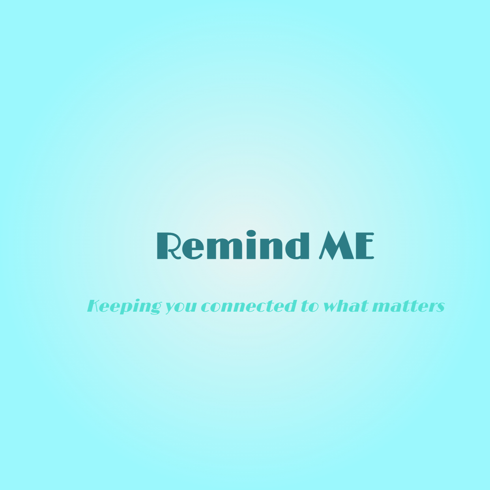

# 🧠 Remind Me — Cognitive Assistance Bracelet for Early Dementia

<p align="center">
  
</p>

<p align="center">
  
  
  
  
</p>

---

## 📌 About The Project

**Remind Me** is a Final Year Project (FYP) designed to assist individuals in the **early stages of dementia**. It combines a **React Native mobile app** with a **custom IoT wearable bracelet** to provide cognitive assistance, safety monitoring, and memory support for patients — while keeping caregivers informed and in control.

---

## 🎯 Key Features

### 🔐 Authentication & Access Control
- Role-based access for **Patients** and **Caregivers**
- Secure login and registration via Firebase Authentication

### ⏰ Smart Reminders
- Set **daily reminders** for medication, meals, exercise, and hygiene
- **Step-by-step task guidance** for complex activities
- Physical bracelet notifications to remind users to wear/check the device

### 🆘 Emergency & Safety
- One-tap **SOS alert** that instantly notifies caregivers
- Real-time **location tracking** via the bracelet
- **Geofencing (Safe Zones)** — alerts triggered when user enters/exits defined zones

### 🗺️ Travel Assistance
- **Departure checklist** before leaving home
- Store and view destination during travel
- **Item location aid** — store photos and descriptions of commonly lost items (keys, wallet, etc.)

### 🧠 Personal Memory Vault
- Record **voice notes** and upload **photos** to store personal memories
- Bracelet randomly reminds users to revisit stored memories

---

## 🛠️ Tech Stack

| Layer | Technology |
|---|---|
| Mobile App | React Native (Expo) |
| Backend | Firebase Firestore, Firebase Functions |
| Authentication | Firebase Auth |
| IoT Device | ESP8266 + LED + Buzzer |
| Location | Google Maps API, Geofencing |
| Notifications | Expo Notifications |
| Storage | Firebase Storage |

---

## 📱 App Screens

| Screen | Description |
|---|---|
| Login / Register | Secure access for patient and caregiver |
| Home | Dashboard with quick access to all features |
| Reminders | Add, view, and manage all reminders |
| Location Tracking | Live map showing patient location |
| Geofencing | Create and manage safe zones |
| Memory Vault | Store and revisit personal memories |
| Item Locator | Save item locations with photos |
| Trip Log | Departure checklist and destination storage |
| Profile | Manage user settings and preferences |

---

## 🔌 IoT Device

The wearable bracelet is built using:
- **ESP8266** microcontroller
- **LED & Buzzer** for physical alerts and reminders
- Communicates with the app via **Firebase Realtime Database**
- Triggers alerts for SOS, reminders, and safe zone violations

---

## 🚀 Getting Started

### Prerequisites
- Node.js
- Expo CLI
- Firebase project setup
- Android device or emulator

### Installation

```bash
# Clone the repository
git clone https://github.com/Gul2806/Remind-Me.git

# Navigate to project folder
cd Remind-Me

# Install dependencies
npm install

# Start the app
npx expo start
```

### Firebase Setup
1. Create a Firebase project at [firebase.google.com](https://firebase.google.com)
2. Enable **Authentication**, **Firestore**, **Storage**, and **Functions**
3. Add your `google-services.json` to the root directory
4. Add your Firebase config to `firebaseConfig.js`

---

## 👨‍💻 Developer

**Gul Raiz**
- BS Information Technology
- Final Year Project — 2025
- 📧 gulraiz57575@gmail.com

---

## 📄 License

This project is for academic purposes as part of a Final Year Project.

---

> *"Technology should serve humanity — especially those who need it most."*
